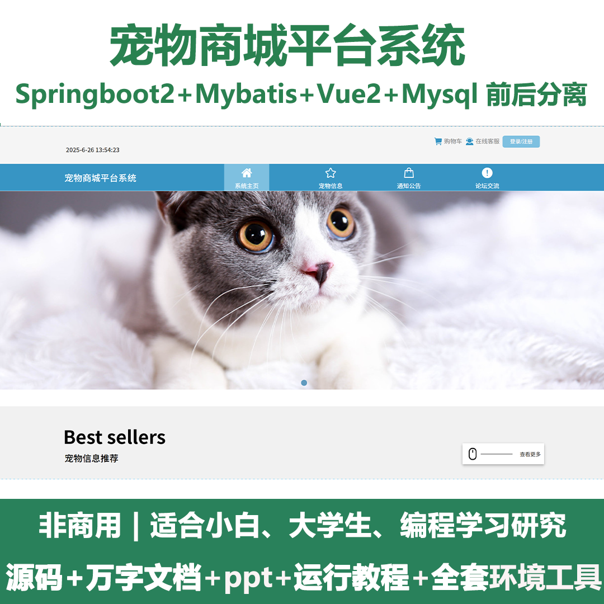
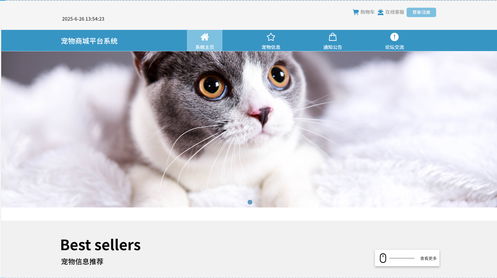
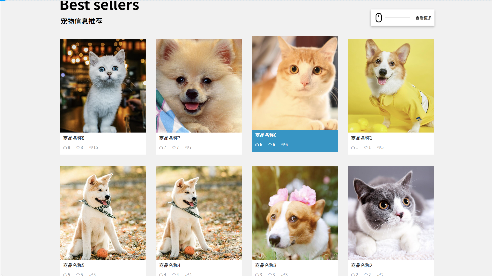
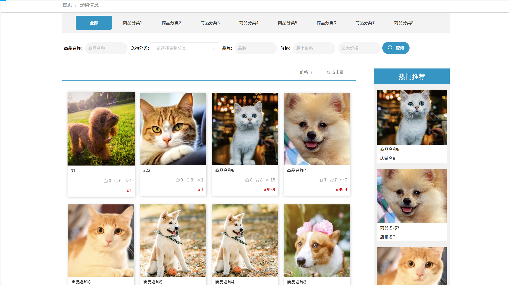
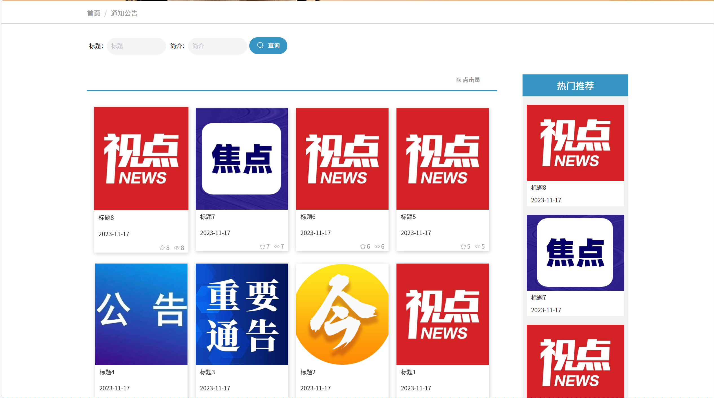
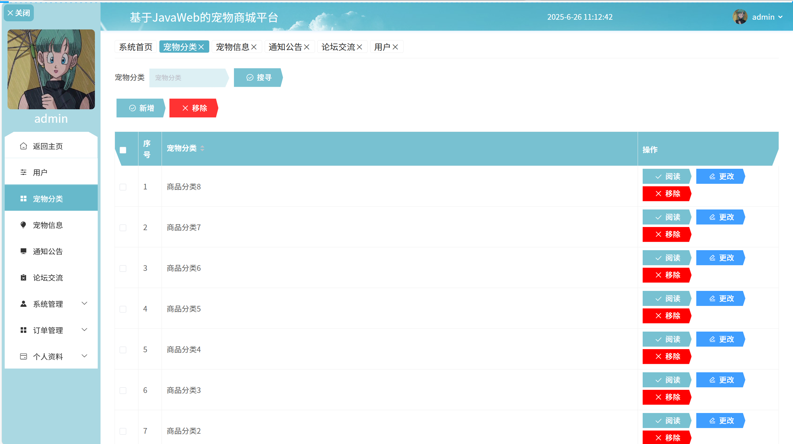
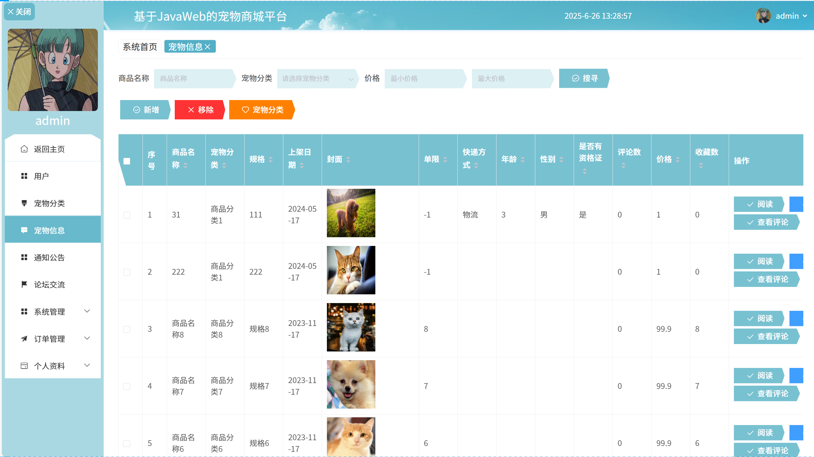
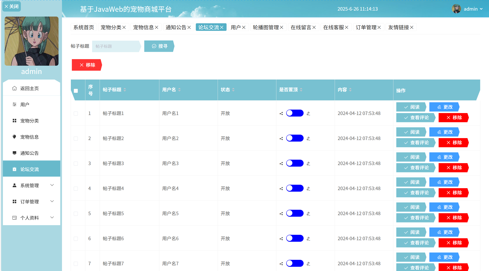
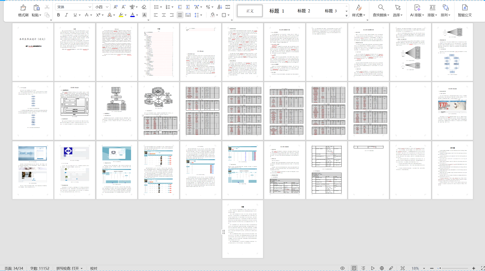

# springbootA404
springbootA404宠物商城平台+LW
 
## 查看主页获取源码

### 一、关键词

宠物用品商城，宠物购物平台，宠物生活服务平台

 

### 二、作品包含

源码+数据库+设计文档万字+全套环境和工具资源+部署教程

 

### 三、项目技术

前端技术：Html、Css、Js、Vue2.0、Element-ui 
后端技术：Java、SpringBoot2.0、MyBatis

  

 

### 四、运行环境（以下版本亲测，其他版本未知，请自测）

开发工具：IDEA/eclipse  + VSCODE

数据库：MySQL5.7（最低要5.7版本）

数据库管理工具：Navicat10以上版本

环境配置软件： JDK1.8 + Maven3.6.3

前端Nodejs：14

浏览器：谷歌浏览器

 

### 五、项目介绍

项目编号：springbootA404

基于JavaWeb的宠物商城平台是一项在优化商品销售流程和提升企业运营效率的信息化解决方案。目前该系统整合了现代化的Java开发框架，通过使用Spring进行项目整体的管理，处理Web请求和MyBatis实现数据持久化，实现了一个功能完备的自销商品管理平台。系统通过Spring框架提供的依赖注入和面向切面编程等特性，实现了灵活可维护的基于JavaWeb的宠物商城平台模块。主要包括了商家管理、商品管理、类型管理、订单管理、购物车管理、系统管理等操作，使得管理员和商家可以便捷地维护宠物信息以及用户购买。

 

### 六、运行截图

